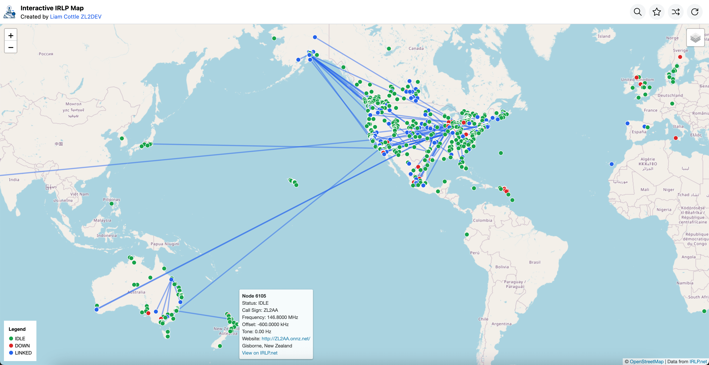

<h2 align="center">IRLP Map</h2>

<p align="center">
<a href="https://discord.gg/K55zeZyHKK"></a>
<a href="https://twitter.com/liamcottle"></a>
<br/>
<a href="https://ko-fi.com/liamcottle"></a>
<a href="./donate.md"></a>
</p>

An interactive map of all IRLP nodes and their status.

My version of the map is available at https://irlp.liamcottle.net



## Install

Clone the project repo.

```
git clone https://github.com/liamcottle/irlp-map
cd irlp-map
```

Install NodeJS dependencies

```
npm install
```

Run the Express Server, to serve the `/api` and Map UI.

```
node index.js
# Server running at http://127.0.0.1:8080
```

> Note: You can also use a custom port with `--port 1234`

## Systemd Service

A systemd service file is available and can be installed with the following commands:

```
sudo cp irlp-map.service /etc/systemd/system/irlp-map.service
sudo systemctl enable irlp-map.service
sudo systemctl start irlp-map.service
sudo systemctl status irlp-map.service
```

> Note: Make sure to update the usernames in the service file if needed.

## Contributing

If you have a feature request, or find a bug, please [open an issue](https://github.com/liamcottle/meshtastic-map/issues) here on GitHub.

## License

MIT

## References

- https://status.irlp.net
